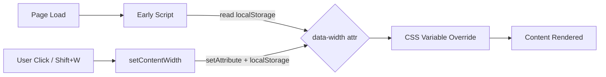

<!--
DESIGN_VERSION: 2.0
GENERATED: 2026-03-12T12:00:00Z
RESEARCH_MODE: agent-swarm + multi-model
RESEARCH_AGENTS: 8
RESEARCH_SOURCES: ~27
DEEP_RESEARCH_USED: true
GEMINI_COLLABORATION: true
CODEX_ADVERSARIAL_REVIEW: true
CODEX_CRITICAL_ISSUES: 2
CODEX_REVISION_CYCLES: 1
OFFLINE_MODE: false
COMPLEXITY_BUDGET: {components:2/3, interfaces:1/2, nodes:4/5}
-->

# Adjustable Content Width

**Version**: 1.0
**Owner**: TBA
**Date**: 2026-03-12
**Status**: Draft

## Executive Summary

- Add 4 named width presets (Narrow/Default/Wide/Full) to mdlive's markdown display
- Use `data-width` HTML attribute on `<html>` to drive CSS variable overrides, mirroring the existing `data-theme` pattern exactly
- Preset buttons added to the existing theme modal (renamed "Appearance")
- Shift+W keyboard shortcut cycles through presets
- Zero change for existing users — Default (900px) matches current behavior

## Scope

### In Scope
- 4 width presets: Narrow (680px), Default (900px), Wide (1200px), Full (100%)
- Preset button UI inside the theme modal
- localStorage persistence with FOUC prevention
- Shift+W keyboard shortcut to cycle presets
- Shortcuts modal documentation update

### Out of Scope
- Per-file width settings
- Custom/arbitrary pixel values
- Drag-to-resize content edges
- Print stylesheet width adjustments
- Mobile-specific width overrides

### Assumptions
- The existing `--content-max-width` CSS variable is the sole control point for content width
- The `max(0px, ...)` clamping in sidebar offset math handles edge cases when width is 100%
- Users adjust width infrequently (set-once preference, not per-session)
- The theme modal is the appropriate home for appearance settings

### Constraints
- Single MiniJinja HTML template — all changes in `templates/main.html`
- Templates are embedded at compile time — requires rebuild after changes
- Must not break existing theme, sidebar, or editor functionality
- Must follow existing patterns (data-attribute, localStorage, early script)

### Deferred Ideas
- None — discussion stayed within scope

### Specific Ideas & References
- Mirrors the `data-theme` pattern already established in the codebase
- Similar to Notion's page width toggle and Obsidian's "Readable line length" setting

## End-State Snapshot

### Success Criteria
- User can switch between 4 width presets via modal buttons or Shift+W shortcut
- Selected width persists across page reloads and browser sessions
- No flash of wrong width on page load (FOUC prevention)
- Default behavior identical to current 900px max-width for users with no saved preference
- Width works correctly in both single-file and directory (sidebar) modes

### Failure Conditions & Guard-rails
- Invalid localStorage values fall back to "default" (900px) via whitelist validation
- localStorage unavailability (private browsing, disabled) handled via try/catch with graceful fallback
- Early script must set `.theme-initialized` in `finally` block to prevent blank page on any error

## Architecture at a Glance

### Components (2)

1. **CSS Width Rules** — 4 attribute selectors on `[data-width]` that override `--content-max-width`. Pure CSS, no JS knowledge of pixel values.
2. **JS Width Manager** — `setContentWidth()`, `cycleContentWidth()`, `updateWidthSelection()` functions plus early script restoration and Shift+W shortcut binding.

### Interfaces (1)

- **localStorage key `content-width`** — stores preset name string (`narrow`, `default`, `wide`, `full`). Read by early script, written by JS Width Manager.

### Flow Diagram



## Requirements Mapping

### Functional Requirements
- FR-001: User can select from 4 width presets (Narrow 680px, Default 900px, Wide 1200px, Full 100%)
- FR-002: Width preference persists across sessions via localStorage
- FR-003: Width applies immediately without page reload (live CSS variable update)
- FR-004: User can reset to default width (selecting "Default" preset)

### Non-Functional Requirements
- NFR-001: No flash of incorrect width on page load (restore before first paint)
- NFR-002: Works identically in single-file mode and directory/navigation mode

### Mapping Table

| Requirement | Component | Test Method |
|------------|-----------|-------------|
| FR-001 | CSS Width Rules + JS Width Manager | Unit: verify each data-width value maps to correct --content-max-width |
| FR-002 | JS Width Manager (localStorage) | Integration: set width, reload page, verify persistence |
| FR-003 | JS Width Manager (setAttribute) | Integration: click preset, verify immediate visual change |
| FR-004 | JS Width Manager | Unit: verify setContentWidth('default') resets variable |
| NFR-001 | Early Script + CSS Width Rules | Integration: set non-default width, hard reload, verify no flash |
| NFR-002 | CSS Width Rules | E2E: test width in both single-file and directory server modes |

## Implementation Details

### 1. CSS: Data-Attribute Width Selectors

Add after the theme `[data-theme]` blocks in `:root` area:

```css
/* Content width presets */
[data-width="narrow"]  { --content-max-width: 680px; }
/* [data-width="default"] uses :root default of 900px — no override needed */
[data-width="wide"]    { --content-max-width: 1200px; }
[data-width="full"]    { --content-max-width: 100%; }
```

No override for "default" — the `:root` declaration of `--content-max-width: 900px` serves as the default. This means missing or invalid `data-width` values gracefully fall back to 900px.

### 2. Early Script: FOUC Prevention

Add to the existing early `<script>` block (after theme restoration, before sidebar):

```javascript
// Restore content width before paint
const savedWidth = localStorage.getItem('content-width');
if (savedWidth && ['narrow', 'default', 'wide', 'full'].includes(savedWidth)) {
    document.documentElement.setAttribute('data-width', savedWidth);
}
```

The entire early script block should be wrapped in try/catch with `.theme-initialized` in finally:

```javascript
(function () {
    try {
        // ... existing theme/sidebar restoration ...
        // ... new width restoration ...
    } catch (e) {
        // localStorage unavailable or other error — use defaults
    } finally {
        document.documentElement.classList.add("theme-initialized");
    }
})();
```

### 3. JS: Width Management Functions

```javascript
const WIDTH_PRESETS = ['narrow', 'default', 'wide', 'full'];

function setContentWidth(preset) {
    document.documentElement.setAttribute('data-width', preset);
    try { localStorage.setItem('content-width', preset); } catch (e) {}
    updateWidthSelection(preset);
}

function cycleContentWidth() {
    const current = document.documentElement.getAttribute('data-width') || 'default';
    const idx = WIDTH_PRESETS.indexOf(current);
    const next = WIDTH_PRESETS[(idx + 1) % WIDTH_PRESETS.length];
    setContentWidth(next);
}

function updateWidthSelection(preset) {
    document.querySelectorAll('.width-card').forEach(card => {
        card.classList.toggle('selected', card.dataset.width === preset);
    });
}
```

### 4. Keyboard Shortcut

Add to existing keydown handler:

```javascript
case 'W':  // Shift+W (uppercase)
    cycleContentWidth();
    break;
```

### 5. Modal UI Changes

Rename modal heading from "Choose Theme" to "Appearance". Add width section after theme grid:

```html
<h3>Appearance</h3>
<!-- existing theme grid -->
<h4 style="margin: 20px 0 12px 0; text-align: center;">Content Width</h4>
<div class="theme-grid" style="grid-template-columns: repeat(4, 1fr);">
    <div class="width-card" data-width="narrow" onclick="setContentWidth('narrow')">
        <div class="theme-card-icon">|||</div>
        <div class="theme-card-name">Narrow</div>
        <div class="theme-card-sample">680px</div>
    </div>
    <div class="width-card" data-width="default" onclick="setContentWidth('default')">
        <div class="theme-card-icon">| |</div>
        <div class="theme-card-name">Default</div>
        <div class="theme-card-sample">900px</div>
    </div>
    <div class="width-card" data-width="wide" onclick="setContentWidth('wide')">
        <div class="theme-card-icon">|  |</div>
        <div class="theme-card-name">Wide</div>
        <div class="theme-card-sample">1200px</div>
    </div>
    <div class="width-card" data-width="full" onclick="setContentWidth('full')">
        <div class="theme-card-icon">[  ]</div>
        <div class="theme-card-name">Full</div>
        <div class="theme-card-sample">100%</div>
    </div>
</div>
```

Width cards reuse `.theme-card` styling (add `.width-card` class extending `.theme-card` for selection behavior).

### 6. Shortcuts Modal Update

Add Shift+W entry to the shortcuts table:

```html
<tr>
    <td><span class="shortcuts-key">Shift+W</span></td>
    <td>Cycle content width</td>
</tr>
```

### 7. Init on DOMContentLoaded

Add to the existing init logic:

```javascript
// Initialize width selection UI
const currentWidth = document.documentElement.getAttribute('data-width') || 'default';
updateWidthSelection(currentWidth);
```

## Testing Strategy

### Unit Testing
- Verify each `data-width` attribute value produces the expected `--content-max-width` computed value
- Verify `cycleContentWidth()` cycles through all 4 presets in order and wraps around

### Integration Testing
- Set width to "wide", reload page, verify `data-width="wide"` is present before DOMContentLoaded
- Verify invalid localStorage value (e.g., "invalid") falls back to default 900px behavior
- Verify localStorage unavailability doesn't break page rendering

### End-to-End Testing
- In directory mode with sidebar: verify all 4 presets render correctly, sidebar offset adjusts
- In single-file mode: verify all 4 presets render correctly
- Verify Shift+W cycles through presets visually
- Verify code files (`content-code`) remain full-width regardless of preset

## Simplicity Analysis

- **Cognitive Load Score**: 2/10 — mirrors existing `data-theme` pattern identically
- **Entanglement Level**: Low — CSS attribute selectors are independent; JS only manages a string attribute
- **New Developer Friendliness**: High — anyone who understands `data-theme` immediately understands `data-width`
- **Refactoring Safety**: High — removing the feature = delete the attribute selectors and JS functions
- **Working Memory Slots**: 1 (the `data-width` attribute is the single source of truth)
- **New Developer Comprehension**: Under 10 minutes (confirmed by Gemini)

## Architectural Decision Records (ADRs)

### ADR-1: Data attribute over CSS variable manipulation or class toggle

**Decision**: Use `data-width` attribute on `<html>` element.
**Alternatives considered**: Direct CSS variable manipulation (Option A), body class toggle (Option B).
**Rationale**: Mirrors `data-theme` pattern exactly. Avoids state duplication (Option A requires JS preset map in both early script and main JS). Avoids FOUC risk (Option B requires `<body>` which may not exist in early script). CSS is source of truth for pixel values — JS only knows semantic preset names.

### ADR-2: Store preset name, not pixel value

**Decision**: localStorage stores `"narrow"`, `"default"`, `"wide"`, `"full"` — not `"680px"`.
**Rationale**: Decouples stored preference from actual values. If we later change Narrow from 680px to 700px, existing stored preferences still work. Enables whitelist validation.

### ADR-3: Override CSS variable via attribute selectors, not max-width directly

**Decision**: `[data-width="wide"] { --content-max-width: 1200px; }` instead of `[data-width="wide"] #content { max-width: 1200px; }`.
**Rationale**: The existing CSS uses `--content-max-width` in multiple places — the `#content` max-width rule, the `.page-container #content` margin-left offset calculation, and potentially future rules. Overriding the variable ensures all dependent rules update automatically.

## Industry Insights (from Web Research)

- Typography research consistently recommends 45-75 characters per line for optimal readability, corresponding to roughly 600-900px content width depending on font size
- Notion, Obsidian, and Typora all offer width presets rather than continuous sliders — validating the preset approach
- CSS custom properties with data-attribute selectors are the recommended modern approach for theming and layout variants
- FOUC prevention via early inline scripts that read localStorage is an established pattern used by major frameworks
- Search Log: domain patterns + anti-patterns + success metrics + failure modes + implementation patterns + modal extension patterns + data-driven UI + deep validation

## Multi-Model Review Summary

### Gemini Collaboration (Phases 2-3)
- Gemini unanimously recommended Option C (Data-Attribute Driven) as "unequivocally the best"
- Key insight: JS has zero knowledge of pixel values — it only manages semantic state names
- Confirmed design is comprehensible by a new developer in under 10 minutes
- Suggested using static array with modulo for cycle logic (adopted)
- Full agreement with Claude's assessment — no disagreements

### Codex Adversarial Review (Phase 4)
- **CRITICAL (resolved)**: `w` shortcut collision with existing "Close tab" binding. Resolved by switching to Shift+W.
- **CRITICAL (resolved)**: localStorage access can blank the app if storage throws. Resolved by wrapping early script in try/catch with `.theme-initialized` in finally block.
- **HIGH (documented)**: `--content-max-width` also drives sidebar offset math. The `max(0px, ...)` clamping handles the "full" preset correctly (offset clamps to 0), but this interaction is documented as a known coupling.
- **MEDIUM (addressed)**: Unvalidated persisted state. Resolved with whitelist validation in early script.
- **MEDIUM (noted)**: Complexity budget for overall template already high. The width feature itself is within budget (2 components, 1 interface); broader template complexity is a pre-existing concern.
- Revision cycles required: 1 (shortcut change + localStorage hardening)
- Unresolved issues: none

## Risks & Mitigations

| Risk | Severity | Mitigation |
|------|----------|------------|
| localStorage unavailable (private browsing) | Medium | try/catch with graceful fallback to 900px default |
| Invalid/stale localStorage value | Low | Whitelist validation: only accept narrow/default/wide/full |
| "Full" width + sidebar offset interaction | Low | max(0px, ...) clamping already handles this; offset becomes 0 |
| Content-code files ignoring preset | None | Existing `.content-code { max-width: none }` rule takes precedence — this is correct behavior |
| Narrow viewport + wide preset | None | CSS max-width naturally caps at available viewport width |

## Configuration & Observability

- **Configuration**: Single localStorage key `content-width` with 4 valid values
- **Logging**: None needed — client-side preference with no server interaction
- **Telemetry**: None — mdlive has no analytics and this is consistent with that design constraint
- **Debugging**: `document.documentElement.getAttribute('data-width')` in browser console shows current state
