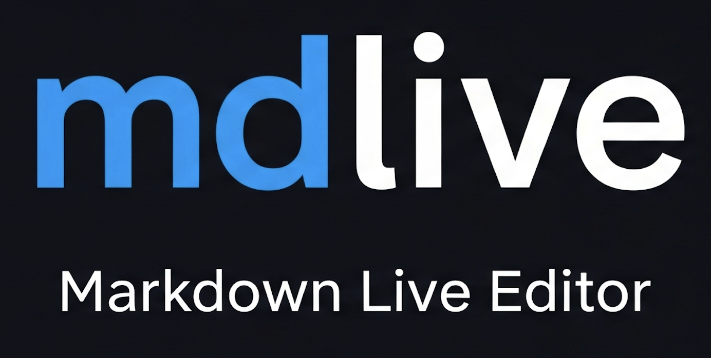

# mdlive

A lightweight markdown editor and live preview server. Point it at a file or directory, get instant rendered output in the browser with live reload. Edit, create, rename, delete -- all from the browser. No config, no setup.

I built this to sit next to AI coding agents. When an agent writes markdown -- plans, architecture docs, research -- I'd rather read it rendered than squint at raw text in a terminal. But it works just as well as a standalone markdown workspace.

This started as a fork of Jose Fernandez's [mdserve](https://github.com/jfernandez/mdserve). The original idea and core implementation are his. I've since taken it in a different direction: in-browser editing, file CRUD, version history, keyboard shortcuts, theming. Different enough to warrant its own repo.

## Quick start

```bash
cargo install mdlive
```

```bash
mdlive README.md         # single file, opens browser
mdlive docs/             # directory mode with sidebar
```

It watches for changes and reloads instantly via WebSocket. New files in directory mode get picked up automatically. The browser opens on launch by default (pass `--no-open` to suppress).

## Features

### Viewing

GFM rendering with tables, task lists, strikethrough, and fenced code blocks. Syntax highlighting via highlight.js. Mermaid diagram rendering. YAML and TOML frontmatter is stripped before rendering. Five themes including three Catppuccin variants, selectable from a palette modal.

### Editing

Every markdown file has a built-in editor accessible via the edit icon or the `e` shortcut. The editor is a split-pane view: raw markdown on the left, live preview on the right. The divider is draggable (persisted to localStorage). Scroll position syncs between panes. An unsaved-changes dot and `beforeunload` guard prevent accidental data loss.

### File operations

Full CRUD from the browser. Create new files, rename/move existing ones, delete with confirmation. All operations available from both the right-click context menu (on sidebar items) and from buttons in the editor header. In single-file mode, right-click the content area for the context menu.

### Version history

Every save creates a timestamped snapshot. Open the history panel in the editor (`h` shortcut or History button) to browse previous versions and restore any of them.

### Directory mode

Pass a directory and mdlive recursively finds all `.md` and `.markdown` files, builds a collapsible tree sidebar. Right-click folders to create files in specific subdirectories. The sidebar is resizable (drag the edge) and collapsible (`k` shortcut or the toggle button). Search the tree by pressing `s`.

### Keyboard shortcuts

Press `/` to see all available shortcuts in a modal. Shortcuts are context-aware -- the modal only shows what's relevant to your current mode.

| Key | Action | Context |
|-----|--------|---------|
| `/` | Show shortcuts | Always |
| `e` | Edit file | View mode |
| `n` | New file | Directory mode |
| `d` | Delete file | View mode |
| `k` | Toggle sidebar | Directory mode |
| `s` | Focus search | Directory mode |
| `Ctrl+S` | Save | Editor mode |
| `h` | Toggle history | Editor mode |
| `Esc` | Close editor / cancel / blur | Always |

Shortcuts are suppressed when typing in inputs, when modifier keys are held, and when dialogs are open.

## Usage

```bash
mdlive file.md                # serve a single file (port 3000)
mdlive docs/                  # directory mode with sidebar
mdlive docs/ -p 8080          # custom port
mdlive file.md --no-open      # don't auto-open the browser
mdlive file.md -H 0.0.0.0    # bind to all interfaces
```

## Development

Rust 1.82+, 2021 edition. Templates and static assets are embedded at compile time (`minijinja-embed`, `include_str!`, `include_bytes!`), so changes to `templates/` or `static/` need a rebuild.

```bash
cargo build --release
cargo test                        # all tests (74 unit + integration)
cargo test --test pages_test      # specific test file
cargo test test_server_starts     # by name
```

See [docs/architecture.md](docs/architecture.md) for internals.

## License

MIT. See [LICENSE](LICENSE).

## Attribution

Based on [mdserve](https://github.com/jfernandez/mdserve) by Jose Fernandez, MIT licensed. Original contributors are in the git history.
