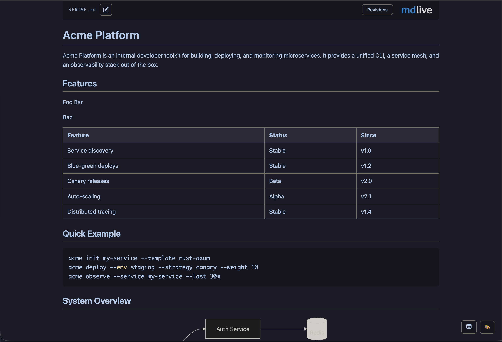
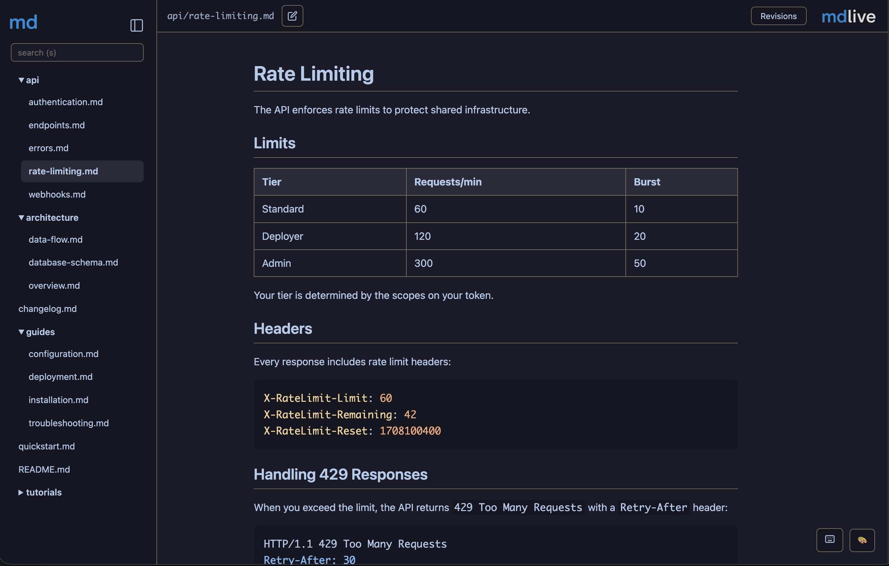
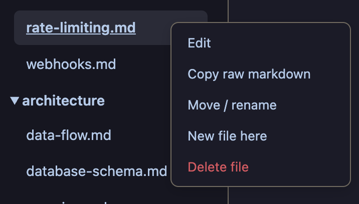
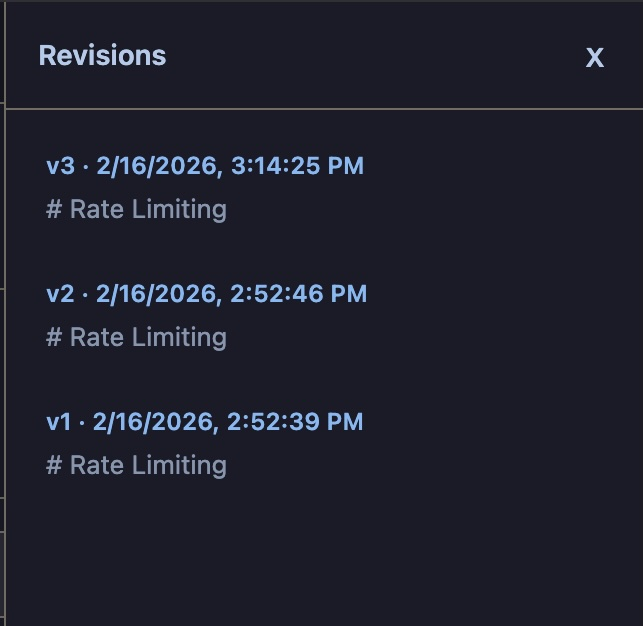
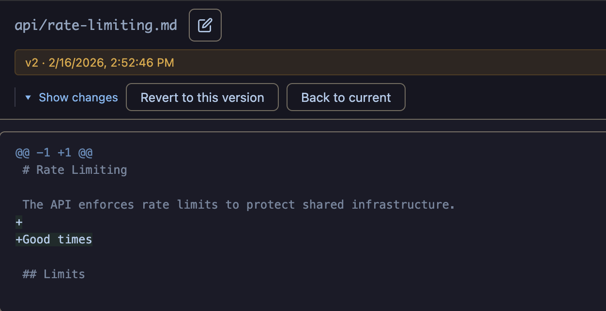

# mdlive

A lightweight markdown editor and live preview server. Point it at a file or directory, get instant rendered output in the browser with live reload. Edit, create, rename, delete -- all from the browser. Run it as a persistent daemon and switch between projects without spawning new processes.

I built this to sit next to AI coding agents. When an agent writes markdown -- plans, architecture docs, research -- I'd rather read it rendered than squint at raw text in a terminal. But it works just as well as a standalone markdown workspace.

This started as a fork of Jose Fernandez's [mdserve](https://github.com/jfernandez/mdserve). The original idea and initial core implementation are his. I've since taken it in a different direction: in-browser editing, file CRUD, version history, workspace switching, keyboard shortcuts, theming. Different enough to warrant its own repo.

https://github.com/bearded-giant/mdlive/raw/main/docs/images/mdlive.mp4

## Install

```bash
cargo install mdlive                          # from crates.io
brew install bearded-giant/tap/mdlive         # homebrew (macOS / Linux)
```

Or build from source:

```bash
git clone https://github.com/bearded-giant/mdlive.git
cd mdlive
cargo build --release
```

Single binary, no runtime dependencies. Everything (templates, JS libraries, images) is embedded at compile time. Prebuilt binaries for macOS and Linux (x86_64 + aarch64) are also available on the [releases page](https://github.com/bearded-giant/mdlive/releases).

### Claude Code plugin

mdlive is available as a [Claude Code](https://docs.anthropic.com/en/docs/claude-code) plugin. Once installed, Claude will automatically use mdlive to preview markdown when it makes sense -- plans, architecture docs, tables, diagrams, and anything that reads better rendered than raw.

```
/plugin install mdlive@bearded-giant/mdlive
```

## Quick start

```bash
mdlive README.md         # single file, opens browser
mdlive docs/             # directory mode with sidebar
mdlive                   # daemon mode -- workspace picker in the browser
```

#### Single file view


#### Directory view


It watches for changes and reloads instantly via WebSocket. New files in directory mode get picked up automatically. The browser opens on launch by default (pass `--no-open` to suppress).

### Running alongside an AI agent

Point mdlive at whatever directory the agent writes to. As the agent creates or updates markdown files, the browser reflects changes in real time.

```bash
mdlive scratch/ &        # background it, work alongside your agent
```

This is particularly useful for reviewing agent-generated plans, design docs, and research as they're being written.

## Features

### Viewing

GFM rendering with tables, task lists, strikethrough, and fenced code blocks. Syntax highlighting via highlight.js. Mermaid diagram rendering. YAML and TOML frontmatter is stripped before rendering. Images referenced in markdown are served inline (png, jpg, gif, svg, webp). Plain text and JSON files are also viewable and editable with syntax highlighting.

### Themes

Five built-in themes: Catppuccin Mocha (default), Catppuccin Macchiato, Catppuccin Latte, Light, and Dark. Switch via the palette icon in the bottom-right corner. Selection is persisted to localStorage.

### Editing

Every markdown file has a built-in editor accessible via the edit icon or the `e` shortcut. The editor is a split-pane view: raw markdown on the left, live preview on the right. The divider is draggable (persisted to localStorage). Scroll position syncs between panes. `Ctrl+S` saves, `Esc` closes. An unsaved-changes dot and `beforeunload` guard prevent accidental data loss.

### File operations

Full CRUD from the browser. Create new files, rename/move existing ones, delete with confirmation. All operations available from both the right-click context menu (on sidebar items) and from buttons in the editor header. In single-file mode, right-click the content area for the context menu.



### Revisions

Every save creates a timestamped snapshot in a `.mdlive/` directory next to your files. Open the revisions panel (`h` or `r` shortcut, or the Revisions button) to browse previous versions and restore any of them. You'll probably want to add `.mdlive` to your `.gitignore` unless you want revision history in your repo -- which can actually be handy for shared design docs or architecture decisions.

 

### Directory mode

Pass a directory and mdlive recursively finds all `.md`, `.markdown`, `.txt`, and `.json` files, builds a collapsible tree sidebar with document tabs for quick switching between open files. Right-click folders to create files in specific subdirectories. The sidebar is resizable (drag the edge) and collapsible (`k` shortcut or the toggle button). Search the tree by pressing `s`.

### Daemon mode

Run `mdlive` with no arguments and it starts in daemon mode -- a single long-running process you keep around. Instead of spawning a new process per directory, you switch between projects from the browser.

On first launch you get a workspace picker: type a path (directories and individual files both work, `~` expansion included) or click a recent entry. Once a workspace is loaded, everything works the same as direct mode -- sidebar, tabs, editing, revisions. Hit `o` or click the folder icon in the bottom-right to switch to a different workspace without restarting.

The recent workspaces list (up to 15 entries, FIFO) is stored at `~/.config/mdlive/config.toml`. This is the only file mdlive writes outside of the directories you open.

#### Auto-start on login (macOS)

mdlive can install itself as a LaunchAgent so it starts automatically when you log in and stays running in the background.

```bash
mdlive service install              # install and start (port 3000)
mdlive service install -p 3030      # use a specific port
mdlive service start                # start the daemon
mdlive service stop                 # stop the daemon
mdlive service status               # check if it's running
mdlive service uninstall            # stop and remove
```

The plist lives at `~/Library/LaunchAgents/com.beardedgiant.mdlive.plist`. Uninstalling removes it cleanly -- no system-level changes, nothing left behind.

### Keyboard shortcuts

Press `/` to see all available shortcuts. Shortcuts are suppressed when typing in inputs, when modifier keys are held, and when dialogs are open.


| Key | Action |
|-----|--------|
| `/` | Show shortcuts |
| `e` | Edit file |
| `n` | New file |
| `d` | Delete file |
| `k` | Toggle sidebar |
| `s` | Focus search |
| `Ctrl+S` | Save |
| `h` / `r` | Toggle revisions |
| `w` | Close tab |
| `o` | Open workspace (daemon mode) |
| `?` | About / attribution |
| `Esc` | Close / cancel |

## Usage

```bash
mdlive                        # daemon mode with workspace picker
mdlive file.md                # serve a single file (port 3000)
mdlive docs/                  # directory mode with sidebar
mdlive docs/ -p 8080          # custom port
mdlive file.md --no-open      # don't auto-open the browser
mdlive file.md -H 0.0.0.0    # bind to all interfaces
mdlive service install        # auto-start on login (macOS)
mdlive service start          # start the daemon
mdlive service stop           # stop the daemon
mdlive service uninstall      # remove auto-start
mdlive service status         # check daemon status
```

## Development

Rust 1.82+, 2021 edition. Templates and static assets are embedded at compile time (`minijinja-embed`, `include_str!`, `include_bytes!`), so changes to `templates/` or `static/` need a rebuild.

```bash
cargo build --release
cargo test                        # all tests (99 unit + integration)
cargo test --test pages_test      # specific test file
cargo test test_server_starts     # by name
```

See [docs/architecture.md](docs/architecture.md) for internals.

## License

MIT. See [LICENSE](LICENSE).

## Attribution

Based on [mdserve](https://github.com/jfernandez/mdserve) by Jose Fernandez, MIT licensed. Original contributors are in the git history.
