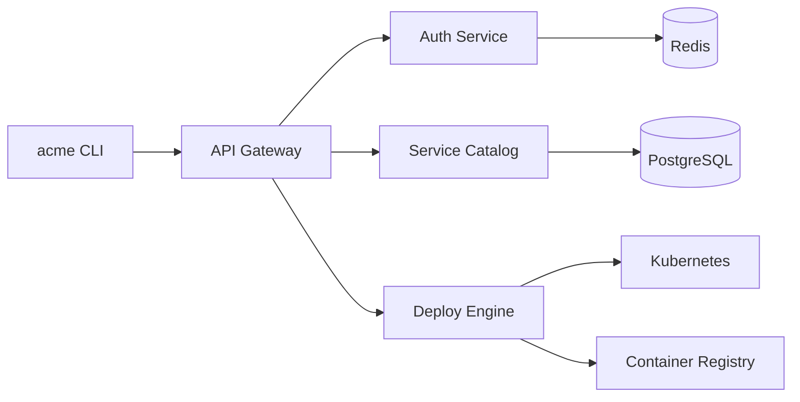

# Acme Platform

Acme Platform is an internal developer toolkit for building, deploying, and monitoring microservices. It provides a unified CLI, a service mesh, and an observability stack out of the box.

## Features

Foo
Bar

Baz

| Feature | Status | Since |
|---------|--------|-------|
| Service discovery | Stable | v1.0 |
| Blue-green deploys | Stable | v1.2 |
| Canary releases | Beta | v2.0 |
| Auto-scaling | Alpha | v2.1 |
| Distributed tracing | Stable | v1.4 |

## Quick Example

```bash
acme init my-service --template=rust-axum
acme deploy --env staging --strategy canary --weight 10
acme observe --service my-service --last 30m
```

## System Overview



## Getting Started

1. Install the CLI with `curl -sSL https://acme.internal/install | sh`
2. Authenticate with `acme login`
3. Scaffold a new service with `acme init`
4. Deploy to staging with `acme deploy --env staging`

See the [quickstart guide](quickstart.md) for a full walkthrough.

## Support

Reach us on **#acme-platform** in Slack or file an issue in the GitLab project.
