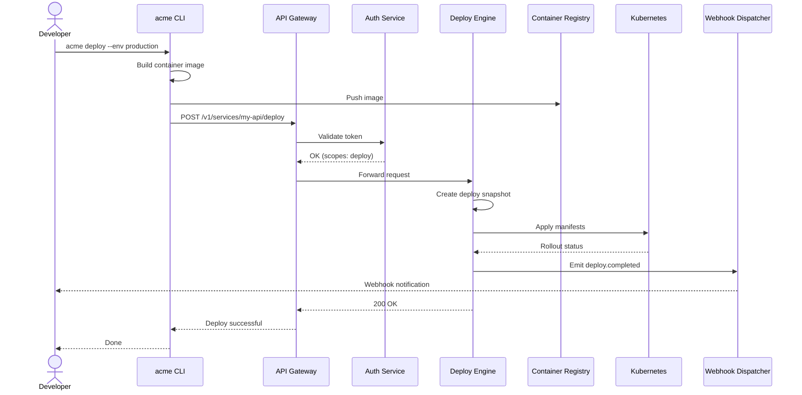
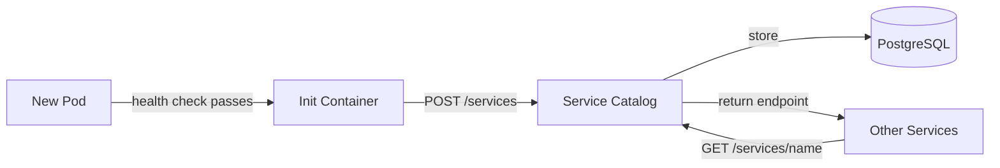
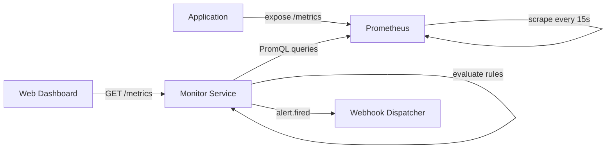

# Data Flow

## Deployment Pipeline

From `acme deploy` to running pods:

## Service Discovery Flow

When a service starts, it registers itself in the catalog:

1. Pod starts and passes health checks
2. Init container calls `POST /v1/services` with metadata from `acme.yaml`
3. Catalog stores entry in PostgreSQL
4. Other services query the catalog for endpoint resolution

## Metrics Pipeline

Prometheus scrapes application metrics every 15 seconds. The Monitor service runs PromQL queries against Prometheus to power the dashboard and evaluate alert rules. When a rule fires, it emits an event through the webhook dispatcher.
