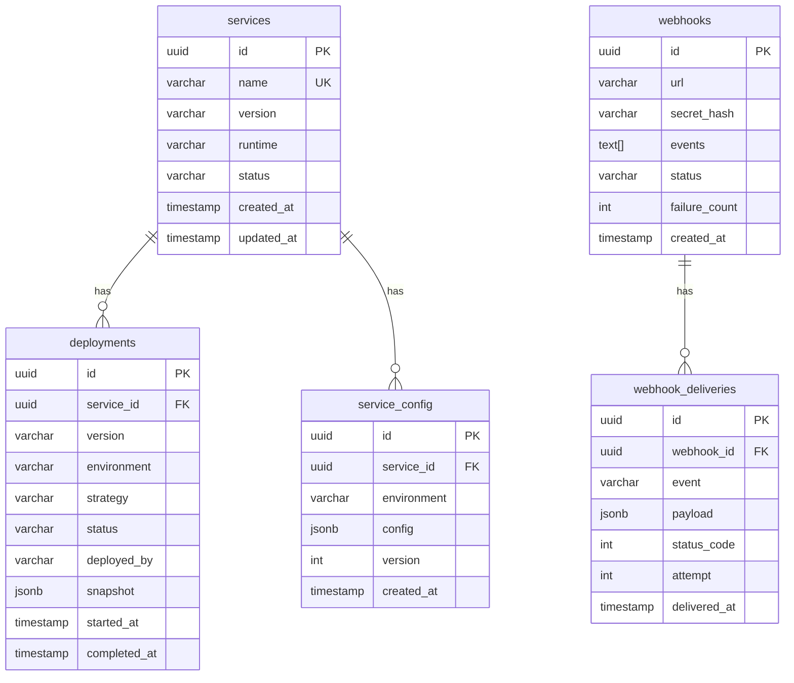

# Database Schema

The Service Catalog uses PostgreSQL 15 with a straightforward relational schema.

## Entity Relationship



## Key Tables

### services

The central registry. `name` is unique and serves as the primary lookup key across the platform.

```sql
CREATE TABLE services (
    id          UUID PRIMARY KEY DEFAULT gen_random_uuid(),
    name        VARCHAR(128) UNIQUE NOT NULL,
    version     VARCHAR(32) NOT NULL,
    runtime     VARCHAR(32) NOT NULL,
    status      VARCHAR(32) NOT NULL DEFAULT 'registered',
    created_at  TIMESTAMPTZ NOT NULL DEFAULT now(),
    updated_at  TIMESTAMPTZ NOT NULL DEFAULT now()
);

CREATE INDEX idx_services_status ON services (status);
```

### deployments

Immutable deployment records. The `snapshot` column stores a full copy of the deployment manifest for rollback support.

```sql
CREATE TABLE deployments (
    id            UUID PRIMARY KEY DEFAULT gen_random_uuid(),
    service_id    UUID NOT NULL REFERENCES services(id),
    version       VARCHAR(32) NOT NULL,
    environment   VARCHAR(32) NOT NULL,
    strategy      VARCHAR(32) NOT NULL,
    status        VARCHAR(32) NOT NULL DEFAULT 'pending',
    deployed_by   VARCHAR(128) NOT NULL,
    snapshot      JSONB NOT NULL,
    started_at    TIMESTAMPTZ NOT NULL DEFAULT now(),
    completed_at  TIMESTAMPTZ
);

CREATE INDEX idx_deployments_service ON deployments (service_id, started_at DESC);
```

### service_config

Versioned configuration per environment. The latest version for a given (service, environment) pair is the active config.

```sql
CREATE TABLE service_config (
    id          UUID PRIMARY KEY DEFAULT gen_random_uuid(),
    service_id  UUID NOT NULL REFERENCES services(id),
    environment VARCHAR(32) NOT NULL,
    config      JSONB NOT NULL,
    version     INT NOT NULL DEFAULT 1,
    created_at  TIMESTAMPTZ NOT NULL DEFAULT now(),
    UNIQUE (service_id, environment, version)
);
```

## Migrations

Managed with `sqlx migrate`. Run locally:

```bash
sqlx migrate run --database-url $DATABASE_URL
```
