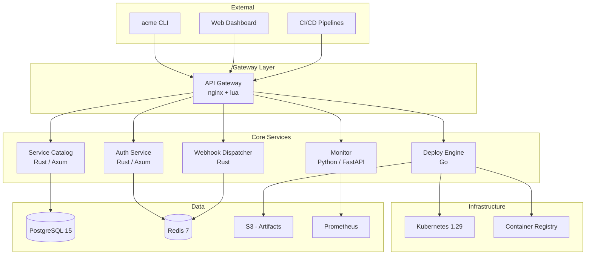

# Architecture Overview

Acme Platform is composed of five core services behind a single API gateway.

## Service Responsibilities

**Auth Service** handles OAuth 2.0 token issuance, validation, scope enforcement, and service account management. Tokens are JWTs signed with RS256, validated at the gateway layer.

**Service Catalog** is the source of truth for registered services, their configurations, and runtime metadata. Backed by PostgreSQL with a simple versioned schema.

**Deploy Engine** orchestrates deployments across Kubernetes clusters. It supports rolling, blue-green, canary, and recreate strategies. Each deploy creates an immutable snapshot for rollback.

**Monitor** aggregates metrics from Prometheus and exposes them through the API and dashboard. It also evaluates alert rules and fires webhook events.

**Webhook Dispatcher** delivers event notifications to registered endpoints with retry logic and signature verification.

## Communication Patterns

All inter-service communication is synchronous HTTP/gRPC through the service mesh. The only async path is the webhook dispatcher, which uses a Redis-backed queue for reliable delivery.
