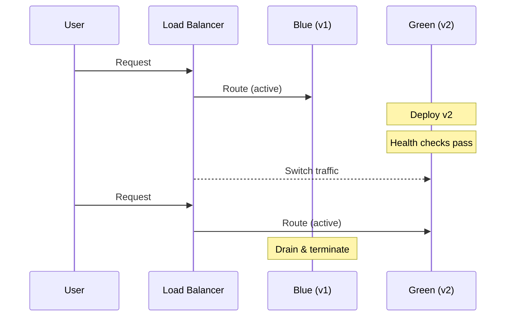

# Deployment Guide

## Strategies

Acme Platform supports four deployment strategies. Choose based on your risk tolerance and traffic patterns.

### Rolling (default)

Replaces pods one at a time. Zero downtime, but both versions run simultaneously during rollout.

```bash
acme deploy --env production --strategy rolling
```

### Blue-Green

Runs the new version alongside the old, then switches traffic atomically.

```bash
acme deploy --env production --strategy blue-green
```



### Canary

Sends a percentage of traffic to the new version. Gradually increase the weight if metrics look good.

```bash
acme deploy --env production --strategy canary --weight 10
# monitor metrics...
acme promote my-api --env production --weight 50
# looks good...
acme promote my-api --env production --weight 100
```

### Recreate

Tears down all old pods before creating new ones. Causes downtime. Only use for stateful services that cannot run two versions.

```bash
acme deploy --env production --strategy recreate
```

## Rollback

Every deploy creates a snapshot. Roll back to the previous version:

```bash
acme rollback my-api --env production
```

Or roll back to a specific version:

```bash
acme rollback my-api --env production --to v1.3.2
```

## Deploy Hooks

Add lifecycle hooks in `acme.yaml`:

```yaml
hooks:
  pre_deploy:
    - acme db migrate --env $ACME_ENV
  post_deploy:
    - curl -X POST https://slack.internal/deploy-notify
```
