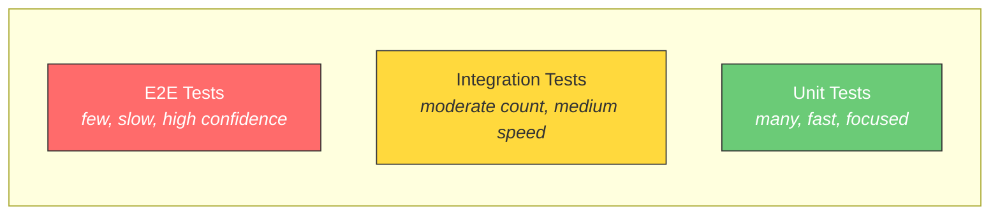

# Testing Strategies

A practical guide to testing services on the Acme Platform.

## Test Pyramid



## Unit Tests

Test individual functions and methods in isolation. Mock external dependencies.

```python
import pytest
from unittest.mock import MagicMock
from src.services.deploy import validate_manifest

def test_validate_manifest_valid():
    manifest = {
        "name": "my-api",
        "version": "1.0.0",
        "runtime": "python",
        "port": 8000
    }
    assert validate_manifest(manifest) is True

def test_validate_manifest_missing_name():
    manifest = {"version": "1.0.0", "runtime": "python"}
    with pytest.raises(ValueError, match="name is required"):
        validate_manifest(manifest)

def test_validate_manifest_invalid_strategy():
    manifest = {
        "name": "my-api",
        "version": "1.0.0",
        "runtime": "python",
        "port": 8000,
        "deploy": {"strategy": "yolo"}
    }
    with pytest.raises(ValueError, match="strategy must be one of"):
        validate_manifest(manifest)
```

## Integration Tests

Test service interactions with real dependencies (database, Redis) using Docker Compose.

```yaml
# docker-compose.test.yaml
services:
  test:
    build: .
    environment:
      DATABASE_URL: postgresql://test:test@db:5432/test
      REDIS_URL: redis://redis:6379/0
    depends_on:
      db:
        condition: service_healthy
      redis:
        condition: service_started

  db:
    image: postgres:15
    environment:
      POSTGRES_USER: test
      POSTGRES_PASSWORD: test
      POSTGRES_DB: test
    healthcheck:
      test: pg_isready -U test
      interval: 2s
      timeout: 5s
      retries: 5

  redis:
    image: redis:7
```

Run integration tests:

```bash
docker compose -f docker-compose.test.yaml run --rm test pytest tests/integration/ -v
```

## E2E Tests

Test full user workflows against a staging deployment:

```python
import requests

BASE = "https://my-api.staging.acme.internal"

def test_full_bookmark_lifecycle():
    # create
    resp = requests.post(f"{BASE}/bookmarks", json={
        "url": "https://example.com",
        "title": "Example",
        "tags": ["test"]
    })
    assert resp.status_code == 201
    bookmark_id = resp.json()["id"]

    # read
    resp = requests.get(f"{BASE}/bookmarks")
    assert any(b["id"] == bookmark_id for b in resp.json())

    # delete
    resp = requests.delete(f"{BASE}/bookmarks/{bookmark_id}")
    assert resp.status_code == 204
```

## Running Tests in CI

Add to your `acme.yaml`:

```yaml
hooks:
  pre_deploy:
    - docker compose -f docker-compose.test.yaml run --rm test pytest -x
```

This runs the full test suite before every deployment. A failure blocks the deploy.
