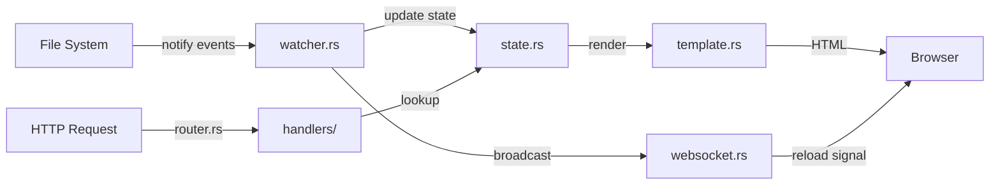
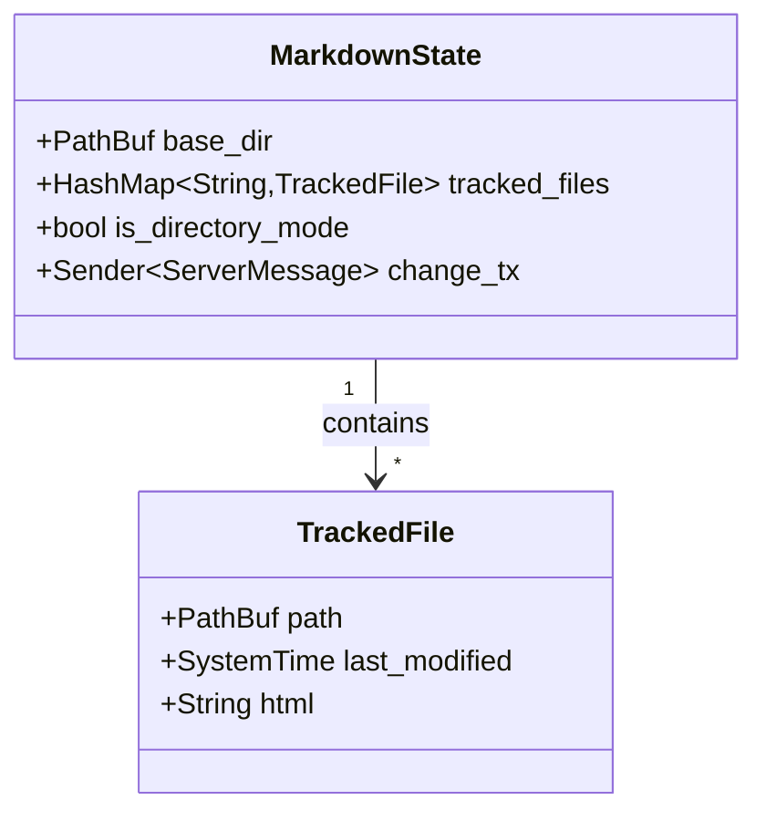

# mdlive Architecture

## Overview

mdlive is a markdown workspace server for AI coding agents with live reload.
It supports single-file and directory modes through a unified architecture.

**Core principle**: Always work with a base directory and a list of tracked files (1 or more).



## Modes

### Single-File Mode
```bash
mdlive README.md
```
- Watches parent directory
- Tracks single file
- No navigation sidebar

### Directory Mode
```bash
mdlive ./docs/
```
- Watches specified directory recursively
- Tracks all `.md` and `.markdown` files
- Shows collapsible tree sidebar

## Module Structure

```
src/
  main.rs           -- CLI parsing (clap), calls lib entry point
  lib.rs            -- public API: serve_markdown(), scan_markdown_files()
  state.rs          -- MarkdownState, TrackedFile, SharedMarkdownState
  router.rs         -- new_router(), route registration, watcher setup
  handlers/
    pages.rs        -- serve_html_root, serve_file, serve_editor, serve_new_file_editor
    api.rs          -- CRUD endpoints, save, version history, restore
    static_files.rs -- embedded JS/image serving with ETag caching
    websocket.rs    -- WebSocket handler for live reload
  watcher.rs        -- file event handling (notify crate)
  tree.rs           -- build_file_tree (pure data transform)
  util.rs           -- is_markdown_file, is_image_file, scan helpers
  template.rs       -- MiniJinja setup, embedded JS constants
```

## State Management

Central state stores:
- Base directory path
- HashMap of tracked files (filename -> metadata + pre-rendered HTML)
- Directory mode flag (determines UI)
- WebSocket broadcast channel



Mode is determined by user intent, not file count:
- `mdlive /docs/` with 1 file shows sidebar
- `mdlive single.md` never shows sidebar

## Live Reload

Uses [notify](https://github.com/notify-rs/notify) crate to watch base directory recursively.

File changes flow:
1. File system event detected by `notify`
2. `handle_file_event` (watcher.rs) processes the event
3. Markdown re-rendered to HTML in `MarkdownState`
4. `ServerMessage::Reload` broadcast via channel
5. WebSocket clients receive reload message
6. Clients execute `window.location.reload()`

Events handled:
- Create/modify: refresh file, add if new (directory mode only)
- Delete: ignored (editors like neovim save via rename-to-backup then create-new)
- Rename: track new path
- Image changes: trigger reload without tracking

## Routing

Single unified router (router.rs) handles both modes:

### Pages
- `GET /` -> first file alphabetically
- `GET /new` -> new file editor
- `GET /edit/:filepath` -> editor for existing file
- `GET /:filepath` -> rendered markdown or images

### WebSocket
- `GET /ws` -> live reload connection

### API
- `GET /api/raw_content` -> raw markdown for a file
- `POST /api/create_file` -> create a new markdown file
- `POST /api/save_file` -> save file content (creates history snapshot)
- `POST /api/delete_file` -> delete a tracked file
- `POST /api/move_file` -> rename/move a tracked file
- `GET /api/file_history` -> list saved versions for a file
- `POST /api/restore_version` -> retrieve content from a past version

### Static assets
- `GET /mermaid.min.js` -> bundled Mermaid library
- `GET /highlight.min.js` -> bundled highlight.js
- `GET /marked.min.js` -> bundled marked parser (editor preview)
- `GET /static/mdlive.png` -> branding logo
- `GET /static/favicon.png` -> favicon
- `GET /static/md.png` -> markdown icon

Directory traversal blocked by `canonicalize` + `starts_with(base_dir)` validation.

## Editor

The editor is a split-pane view: raw markdown textarea on the left, live HTML preview on the right. The divider is draggable and its position is persisted to localStorage.

Save creates a timestamped snapshot in `.mdlive_history/{filename}/` alongside the base directory. The history panel lists snapshots and any can be restored into the editor. A revision badge in the header indicates when viewing a past version.

Client-side preview uses marked.js to render markdown without a server round-trip. Mermaid diagrams and syntax highlighting are applied in the preview pane.

## Rendering

Uses [MiniJinja](https://github.com/mitsuhiko/minijinja) with templates embedded
at compile time via `minijinja_embed`. Single template (`main.html`) handles both
modes and editor/view states via conditional blocks.

Template variables:
- `content`: pre-rendered markdown HTML
- `raw_content`: raw markdown (editor mode)
- `mermaid_enabled`: conditionally includes Mermaid.js
- `show_navigation`: controls sidebar visibility
- `editor_mode`: toggles editor vs read-only view
- `new_file_mode`: new file creation variant of editor
- `has_history`: whether history snapshots exist
- `tree`: nested tree of files and directories
- `current_file`: active file's relative path

## Design Decisions

**Unified architecture**: single code path handles both modes. Mode determined by user intent, not file count.

**Pre-rendered caching**: all tracked files rendered to HTML in memory on startup and on change. Serving always from memory, never from disk.

**Recursive directory tree**: subdirectories scanned and watched recursively. Sidebar renders a collapsible tree using `<details>/<summary>` elements.

**No file removal on delete**: editors save via rename-to-backup then create-new. Removing on delete would cause transient 404s.

**Server-side rendering, client-side editor preview**: view mode serves pre-rendered HTML from memory. Editor mode uses marked.js on the client for instant preview without round-trips.
